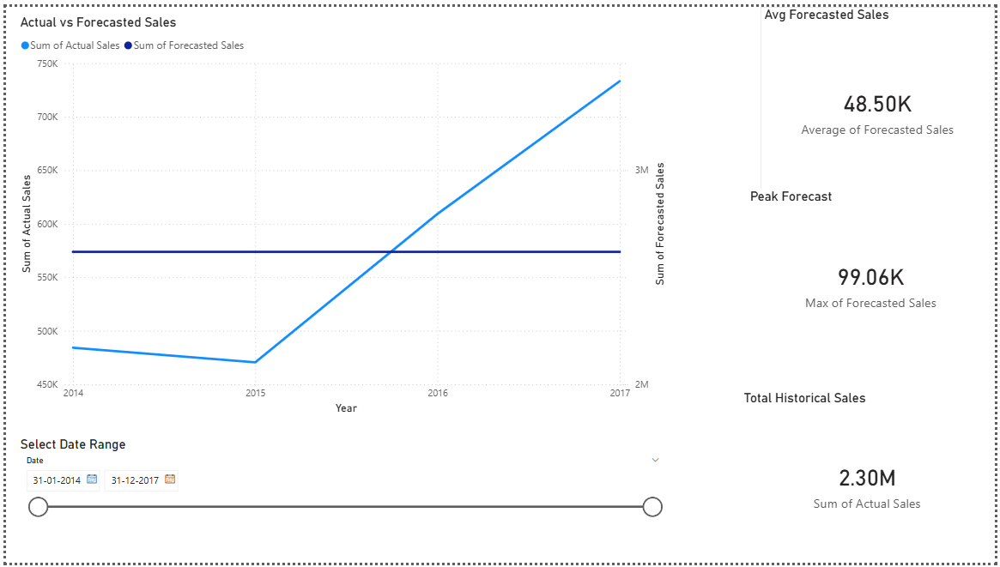
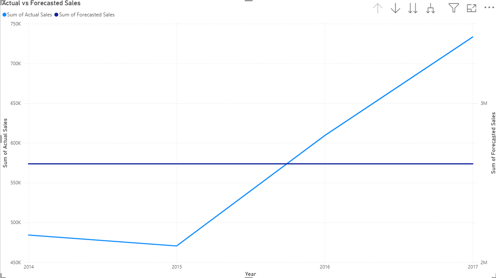
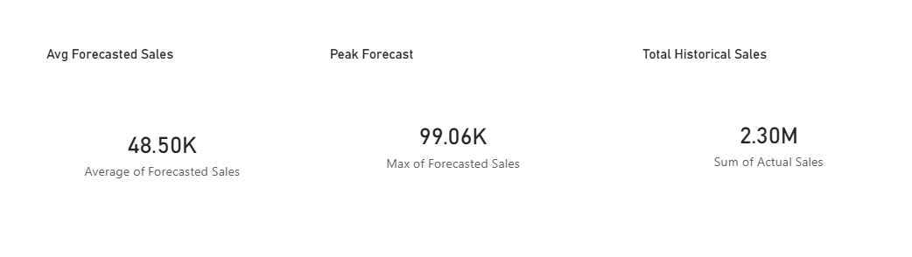
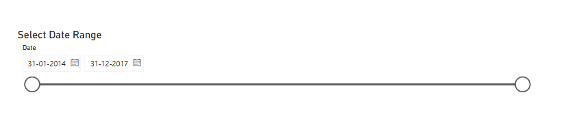

# AI-Powered Sales Forecasting Dashboard

## 📌 Project Overview

This project focuses on building an AI-powered sales forecasting system using historical retail transaction data and presenting insights through an interactive Power BI dashboard.  
The goal is to help retail businesses predict future sales trends and make informed decisions related to inventory planning, marketing, and revenue forecasting.

This project was completed as **Machine Learning Task 1** under the **Future Interns Internship Program**.

---

##  Dataset Description

- **Dataset:** Superstore Sales Dataset  
- **Total Records:** 9,994 rows  
- **Total Features:** 23 columns  
- **Time Period Covered:** January 2014 – December 2017  
- **Target Variable:** Sales  

The dataset contains detailed information about customer orders, categories, regions, sales, discounts, and profits.

---

##  Tools & Technologies Used

- Python (Pandas, NumPy, Matplotlib)
- Facebook Prophet (Time Series Forecasting)
- Jupyter Notebook (EDA & model development)
- Power BI Desktop (Dashboard & visualization)

---

##  Project Workflow

### 1️. Data Cleaning & Preprocessing
- Loaded and inspected the dataset
- Converted date columns (Order Date, Ship Date) to datetime format
- Aggregated transactional data into monthly total sales
- Prepared time-series data in Prophet-compatible format (`ds`, `y`)

---

### 2️. Exploratory Data Analysis (EDA)
- Analyzed historical sales trends
- Identified seasonal patterns across months
- Observed higher sales during Q4 (November–December)

---

### 3️. Feature Engineering
- Extracted Year and Month from order dates
- Created monthly sales aggregates for forecasting

---

### 4️. Time Series Forecasting
- **Model Used:** Facebook Prophet
- **Seasonality:**
  - Yearly seasonality enabled
  - Weekly & daily seasonality disabled (monthly data)
- **Forecast Horizon:** Next 6 months

---

### 5️. Forecast Results (Key Metrics)

| Metric | Value |
|------|------|
| Total Historical Sales | 2,297,200.86 (~2.30M) |
| Average Forecasted Monthly Sales | 48,497.10 (~48.50K) |
| Peak Forecasted Sales | 99,056.32 (~99.06K) |
| Lowest Forecasted Sales | 5,778.54 |
| Highest Forecasted Month | November 2017 |

**Confidence Interval for Peak Month (Nov 2017):**
- **Lower Bound:** 89,610  
- **Upper Bound:** 108,784

  ---

  ##  Power BI Dashboard Features

The interactive Power BI dashboard includes:

- ✔ Actual vs Forecasted Sales Line Chart
- ✔ KPI Cards:
  - Total Historical Sales
  - Average Forecasted Sales
  - Peak Forecasted Sales
- ✔ Date Range Slicer for dynamic filtering
- ✔ Clean, business-friendly layout

This dashboard allows stakeholders to visually compare historical performance with future predictions.

###  Dashboard Overview


###  Actual vs Forecasted Sales


###  KPI Cards


###  Date Range Slicer


---

##  Business Insights & Recommendations

- Sales show a clear upward trend over time.
- Q4 months (Nov–Dec) consistently experience higher sales.
- Forecast indicates stable growth in upcoming months.

###  Recommendations
- Increase inventory before high-demand months.
- Plan promotional campaigns during low-sales periods.
- Use forecasts for budgeting, staffing, and supply-chain planning.

---

##  Repository Structure

```text
sales-forecasting-dashboard/
│
├── data/          # Raw dataset
├── notebooks/     # Jupyter notebooks (EDA & ML)
├── outputs/       # Forecast & historical CSV files
├── powerbi/       # Power BI dashboard files
└── README.md
```

---

##  Project Outcome

Successfully built an end-to-end sales forecasting solution combining:
- Machine learning for prediction
- Data visualization for business storytelling
- Actionable insights for decision-making

---

##  Internship Context

This project was completed as part of the **Future Interns – Machine Learning Internship**, demonstrating practical skills in:
- Time-series forecasting
- Data analytics
- Business intelligence visualization

  ---

  ## Author

Guntur Ridhi

📧 gunturridhi@gmail.com

🔗 https://github.com/Ridhi-215


